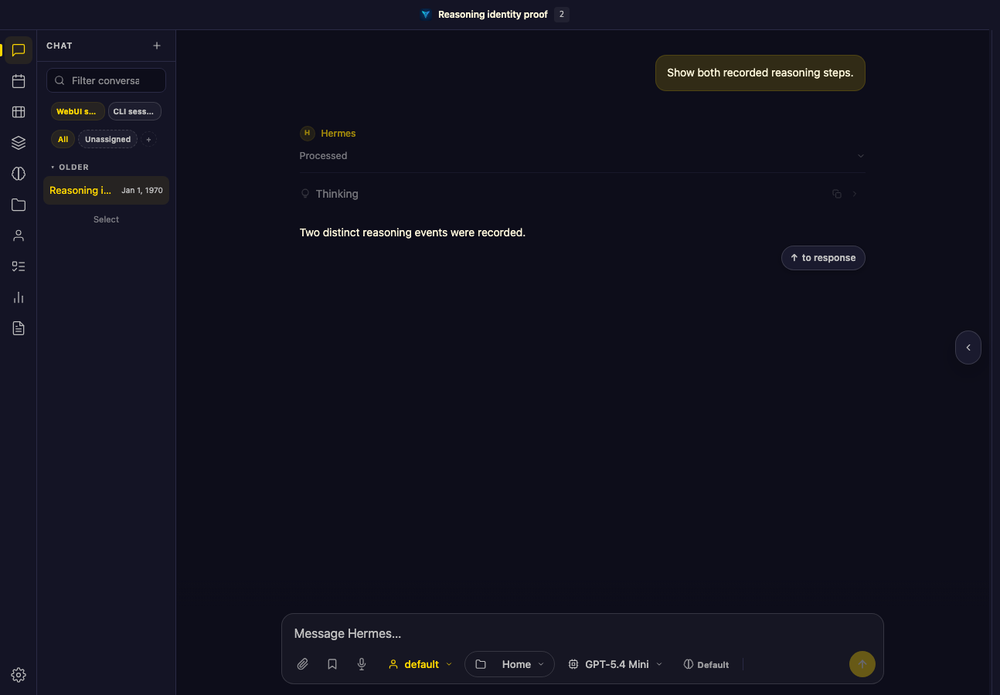
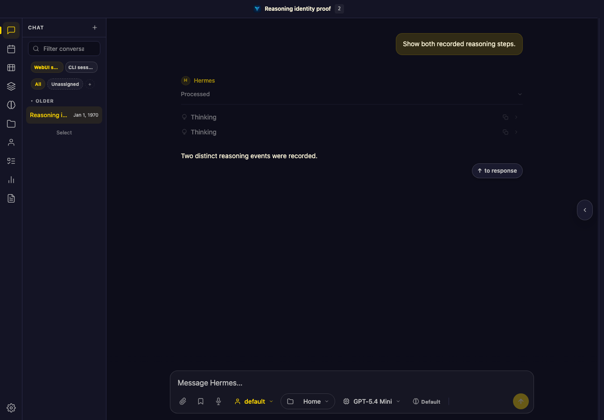
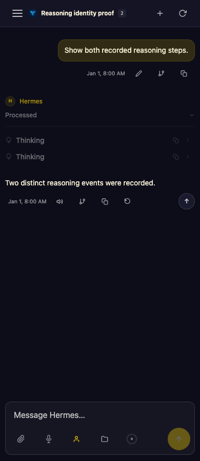
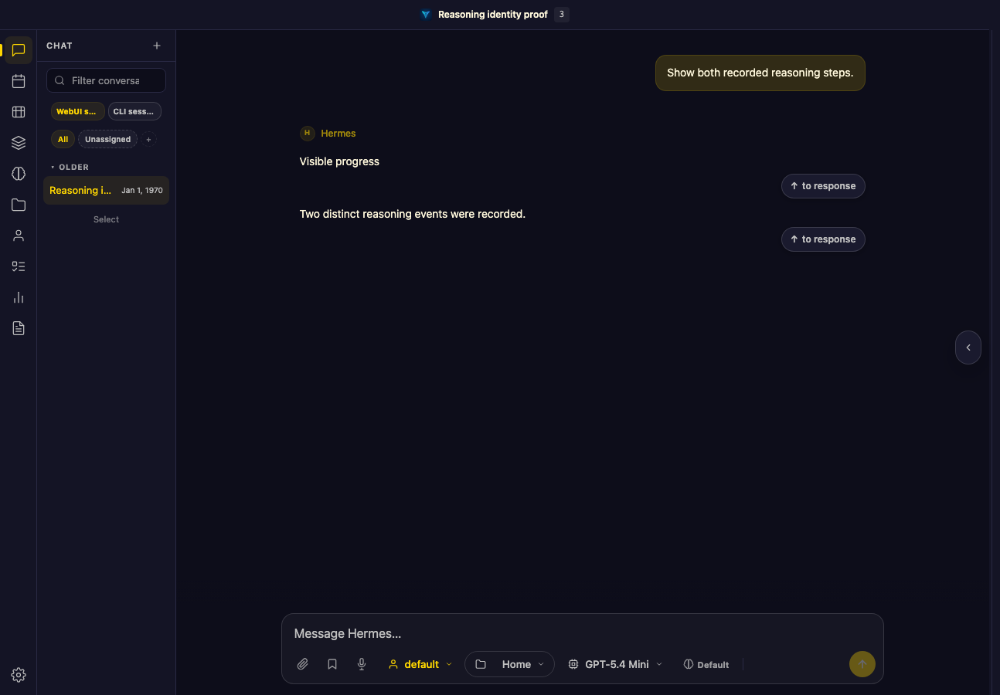
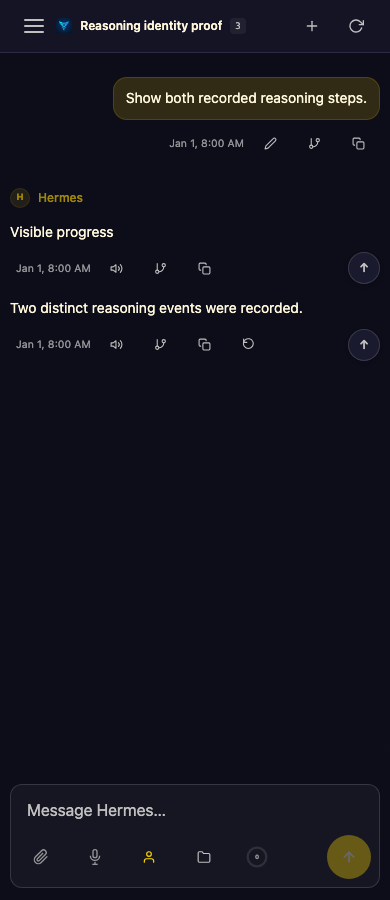
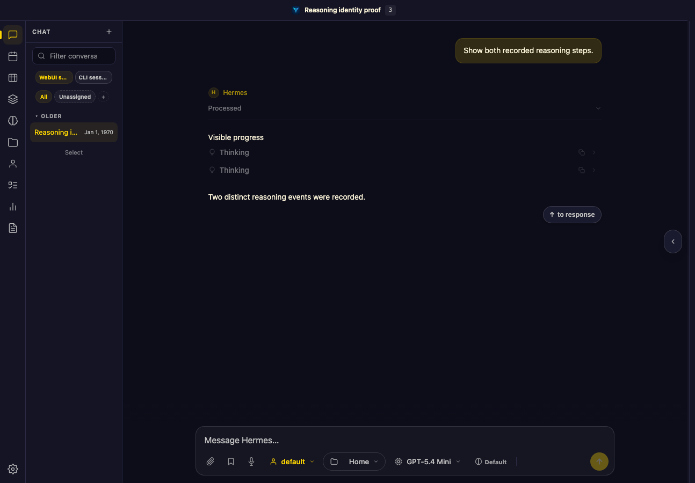
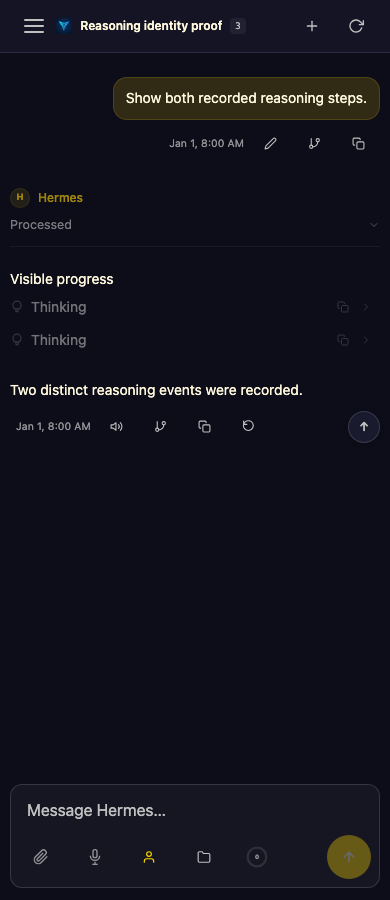

# Stored reasoning identity: browser evidence

These are synthetic persisted-session fixtures, not user conversations. They run
through `Session.save()`, the real WebUI HTTP session loader and the unmodified
browser renderer. No Agent/provider invocation is made. Public static assets load
as in the existing browser gates; this is not a network sandbox certification.

Frozen baseline: `ff26335b87610f70d74ff008608a321fb1281bd1`.
The fixture contains two same-text events with IDs A/B and one exact redelivery
of A. Before the API fix, both initial load and hard reload show only A. After the
fix they show A/B exactly once. Tests assert the DOM row identities, not merely
that two labels are visible. The Thinking cards are collapsed in these captures;
the machine-readable snapshots also check their identical retained text.

| State | Desktop (1280px) | Narrow (390px) |
| --- | --- | --- |
| Before |  |  |
| After |  |  |

Reproduce from the candidate checkout:

```sh
.venv/bin/python tests/browser_reasoning_identity_hydration.py --artifact-dir /tmp/reasoning-proof
```

The same driver on the baseline fails all four load/reload × desktop/narrow
identity assertions. It uses disposable Hermes/state/workspace directories and
stops its own server/browser; it does not modify production sessions. Test setup
initially lacked the seed directory and a trial's blanket external-resource block
caused console failures. Neither was counted as product RED evidence. The final
baseline/candidate comparison uses the same corrected driver.

## October 1 filtered-reasoning regression

Baseline: reviewed head `5ca72febbab3` plus normal upstream merge
`dd5451903686` (product fix absent). A persisted running Thinking row carries
its exact stream identity. Transcript reasoning either repeats visible progress
or matches the final answer; neither should consume a reconciliation slot.

Both variants fail the intended DOM identity assertion on baseline: the two saved
Thinking events are absent on load and hard reload at 1280px and 390px. After the
slot filter, both variants preserve A/B exactly once in all eight combinations.
The four images below show the visible-prose variant after hard reload; the
final-answer variant has the same missing/preserved event outcome.

| State | Desktop (1280px) | Narrow (390px) |
| --- | --- | --- |
| Before |  |  |
| After |  |  |

```sh
.venv/bin/python tests/browser_reasoning_identity_hydration.py --filtered-reasoning visible-prose --artifact-dir /tmp/reasoning-filter-prose
.venv/bin/python tests/browser_reasoning_identity_hydration.py --filtered-reasoning final-answer --artifact-dir /tmp/reasoning-filter-final
```

These remain synthetic, isolated Chromium checks; no physical-device or live
provider behavior is claimed. An initial trial lacked per-row stream ownership
and passed on baseline, so it is not negative proof. A second trial waited for
an absent worklog and timed out; the final driver captures missing rows and fails
on their identities instead of counting a timeout as evidence.
